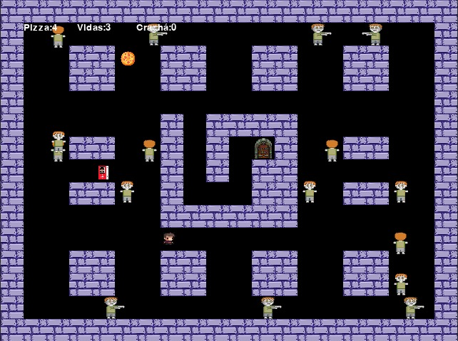
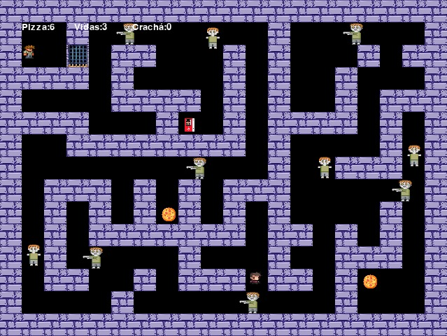

# Projeto P1: Resgate de Marcelinho

Aqui encontra-se o sistema interativo denominado Resgate de Marcelinho, um jogo 2D no estilo top down, desenvolvido como projeto final da disciplina de Programação 1 pelos alunos do curso de Sistemas de Informação da Universidade Federal de Pernambuco.

## Integrantes da Equipe 1 e suas funções

`Ismael Henrique (ihxcs)` - criação de classes.

`José Leandro (jlsf)` - criação de repositório, desenvolvimento do placar e organização do código.

`Júlia Nunes (jnas2)` - implementação de mapas e documentação.

`Lucas Américo (lacl)` - main e debug do código.

`Sara Simone (sseap)` - implementação do áudio, sprites e telas estáticas no código.

## Link para repositório git

https://github.com/jlsf1/Projeto-P1

## Instruções

Para execução do código, é necessário que você possua Python e Pygame instalados.

- Faça o download do branch main deste repositório e extraia o arquivo .zip.
- Abra a pasta Projeto-P1 no seu editor de escolha.
- Execute o arquivo main.py.

O movimento do jogador é controlado através das setas: esquerda, direita, para cima e para baixo. O objetivo do jogador é libertar Marcelinho de sua prisão, para isso ele deve passar pelos labirintos sem colidir com os zumbis, coletar pizzas, para ganhar invulnerabilidade aos danos, e crachás para conseguir passar de fase.

### Efeitos das Colisões:
- Pizza: Aumenta o número de pizzas em um. Pizzas conferem invulnerabilidade ao próximo dano sofrido por contato com zumbis, evitando ter que recomeçar o nível atual.
- Zumbi: Se possuir pizzas, diminui seu número em um e confere breve invulnerabilidade ao jogador, para que este saia do perigo. Se não possuir, remove uma das vidas do jogador(potencialmente levando-o a perder o jogo) e o transporta para a posição inicial do nível atual.
- Coca-café: Aguça os sentidos e velocidade do jogador, fazendo ele perceber os zumbis mais lentamente do que eles realmente são, o que na prática reduz a velocidade dos zumbis pela metade pelos próximos segundos.
- Crachá: Aumenta em 1 o número de crachás(só há um por sala). Permite que o jogador passe pela porta.
- Paredes: Impedem movimento
- Porta: Se não possuir crachá, se comporta como parede. Se possuir, consome um crachá para levar o jogador para a próxima fase.

## Organização do código

/imagens
> Imagens separadas por categoria: coletáveis, mapas, personagens e telas

/sons
> Arquivos de áudio implementados no jogo

/Classes
> Pasta com todas as classes usadas ao longo do projeto e separadas por arquivo

/leveis.py
> Dados das mapas de todos os níveis 

/main.py
> Estrutura principal do jogo

## Bibliotecas e ferramentas utilizadas

Utilizamos o Python como ferramenta para desenvolver o jogo. Além das IDEs Visual Studio Code e Pycharm. Optamos por usar a biblioteca Pygame em razão ao fornecimento de módulos e funções que facilitam a criação de jogos 2D interativos, além da sua simplicidade e facilidade de uso para iniciantes, e devido a sua popularidade e comunidade ativa, ser possível encontrar facilmente soluções que pudessem corrigir nossos erros, visto que muitos problemas são comum. Outras ferramentas utilizadas na criação de elementos artísticos dentro do projeto foram os softwares Paint 3D e CorelDRAW. 

## Conceitos que foram apresentados durante a disciplina e utilizados no projeto

Na implementação básica do jogo, aplicamos, assim como visto em sala, princípios fundamentais da programação. Utilizamos operadores lógicos para realizar comparações e decisões, comandos condicionais para criar ramificações no código com base em diferentes situações e laços de repetição para executar as ações do menu..

Para estruturar os mapas do jogo, empregamos conceitos de listas para criar matrizes que representam a disposição das paredes. Essas listas são essenciais para criar uma estrutura organizada que define os obstáculos e os caminhos disponíveis no jogo. Além disso, utilizamos parâmetros para armazenar as coordenadas dos objetos, como coletáveis, inimigos e jogador, permitindo que o jogo os posicione corretamente no mapa.

Na criação dos objetos do jogo, aplicamos a programação orientada a objetos (POO) utilizando classes para definir as características e comportamentos dos objetos. Cada classe representa um tipo específico de objeto no jogo, os atributos dessas classes representam as propriedades dos objetos, enquanto os métodos definem as ações que esses objetos devem ou podem realizar.

## Os desafios, erros e lições aprendidas no decorrer do projeto.

Ao iniciar o projeto, nos deparamos com desafios significativos, especialmente em relação à compreensão da programação orientada a objetos, ao uso do Pygame, Git e GitHub. A dificuldade inicial estava não apenas na assimilação dos conceitos, mas também na aplicação prática dessas ferramentas. O maior desafio enfrentado foi coordenar as tarefas e avançar no projeto enquanto sofriamos as restrições de tempo impostas pelas demais disciplinas, o que levou a momentos em que o progresso do projeto estava estagnado. Para superar este desafio, decidimos fazer uso da janela de tempo perto do final do projeto, onde apenas a disciplina de P1 estaria em nossas costas, para resolver partes mais cosméticas ou complicadas do projeto(como sprites e resolução de bugs).

Durante a elaboração do jogo, cometemos erros na harmonização de ideias e na criação de uma lógica coesa. Um dos principais obstáculos foi subestimar a importância da organização do código. Visto que estávamos acostumados a trabalhar individualmente, tivemos que nos adaptar aos diferentes estilos de codificação. Esta foi a primeira experiência de muitos de nós em trabalho colaborativo, e isso demandou um período de ajuste para alinhar nossas abordagens e garantir consistência no código. 

Talvez o maior dos erros cometido tenha sido não alinhar devidamente as expectativas e ideias do que seria nosso jogo no fim das contas. Faltou clareza na comunicação inicial, e cada um dos membros tinha um jogo idealizado, achando erroneamente que os demais compartilhavam a ideia, e cada um estava implementando pensando na sua versão, o que gerou choques no código e desentendimentos na equipe. Lidamos com este erro aumentando o número de pontos de comunicação entre a equipe, usando da ferramenta Whatsapp para manter os demais sempre atualizados do que estava sendo feito, e sempre comunicando e pedindo opiniões antes de implementar novas funções ao código. Reuniões frequentes no Discord também ajudaram. 

Ao enfrentar os desafios iniciais, percebemos que a aprendizagem não se limitava apenas à aquisição de conhecimento sobre nossas tarefas individuais. Descobrimos que também aprendemos significativamente ao identificar e resolver problemas no código de outras pessoas. Ao examinar os erros e solucioná-los em conjunto, aprimoramos não apenas nossas habilidades técnicas, mas também nossa capacidade de trabalhar eficazmente como equipe. Além disso, percebemos o quão importante é a comunicação eficaz para garantir que os esforços da equipe se somem, e não se subtraiam. 

